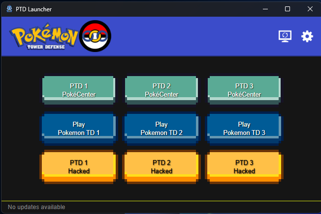

# PTD Launcher

A modern desktop launcher for Pokemon Tower Defense (PTD) games, built with [Tauri](https://tauri.app/).


## Overview

PTD Launcher provides a seamless way to play the classic Pokemon Tower Defense games on modern systems. It handles the necessary Flash Player integration and provides an easy-to-use interface.

## Features

- **Multi-Game Support**: Play PTD 1, PTD 2, and PTD 3 (including Hacked versions).
- **Cross-Platform**: Runs on Windows, Linux, and macOS.
- **Modern Tech Stack**: Built with Rust and React for performance and reliability.
- **Flash Integration**: Automatically manages Flash Player dependencies.

## Usage



## Installation

Download the latest release for your operating system from the [Releases](https://github.com/d8l8b/PTD-Launcher/releases) page.

### Linux Requirements

On Ubuntu/Debian-based systems, you may need `libgtk2.0-0` for Flash Player support (if using the legacy flash standalone player) and `webkit2gtk` for the Tauri app itself.

```bash
sudo apt update
sudo apt install libwebkit2gtk-4.0-37
```

## Development

### Prerequisites

- [Rust](https://www.rust-lang.org/tools/install)
- [Node.js](https://nodejs.org/) (v18+)

### Setup

1. Clone the repository:

   ```bash
   git clone https://github.com/d8l8b/PTDLauncher.git
   cd PTDLauncher
   ```

2. Install dependencies:

   ```bash
   npm install
   ```

3. Run in development mode:

   ```bash
   npm run tauri dev
   ```

## Building

To build the application for production:

```bash
npm run tauri build
```

The build artifacts will be located in `src-tauri/target/release/bundle/`.

## License

This project is licensed under the **MIT License**. See the [LICENSE](LICENSE) file for details.

## Credits

Forked from [PTD-Launcher](https://github.com/tivp/PTD-Launcher) and [PTDLauncher](https://github.com/Xeleron/PTDLauncher).
Based on work by original PTD Launcher developers.
